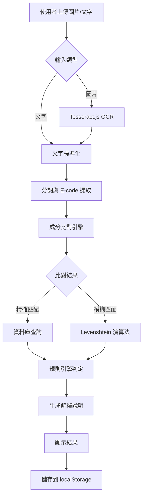

## 🥬 專案名稱

**VeggieScan｜素食掃描識別器**

---

## 💡 專案概念（Project Concept）

**「讓素食者與關心成分的人，在任何國家都能安心購物。」**

VeggieScan 是一個基於 **文字辨識（OCR）** 與 **成分比對邏輯** 的 Web 應用程式。
使用者只需拍照上傳食品包裝成分表，系統會自動解析文字並判斷該商品是否適合素食者食用。

專案靈感來自真實旅遊經驗：

> 在國外購物時，語言障礙與複雜添加物代碼讓素食者難以判斷是否能吃。

### ✨ 核心功能

- 📸 **圖片上傳 OCR**：支援拖曳、點擊、拍照上傳
- 📝 **文字輸入分析**：直接貼上成分文字
- 🤖 **AI 智慧過濾**：使用 Gemini AI 自動過濾非成分資訊（營養標示、保存方式等）
- 🔧 **OCR 錯誤修正**：自動修正常見 OCR 辨識錯誤（如：海答→海苔、辣板紅→辣椒紅）
- 🧩 **複合成分拆分**：自動拆分括號內的複合成分（如：調味料(蔗糖、鹽)→蔗糖、鹽）
- 🔍 **智慧成分比對**：模糊匹配 + 別名識別 + E-code 識別
- ✅ **三級判定系統**：可食用 / 需確認 / 不可食用
- 📊 **詳細說明**：每個成分的判定原因
- 📜 **歷史記錄**：保存最近 10 筆查詢
- 🌏 **多語言 OCR**：支援繁體中文 + 英文辨識

---

## 🎯 使用情境

1. **在超市購物**：拍下成分表，立即知道能否食用
2. **網購前確認**：複製商品頁面的成分文字，快速判斷
3. **學習成分知識**：了解各種 E-codes 與添加物的來源

---

## 快速開始

### 安裝依賴

```bash
pnpm install
```

### 本地開發

```bash
pnpm dev
```

開啟瀏覽器訪問 [http://localhost:3000](http://localhost:3000)

### 建置專案

```bash
pnpm build
pnpm start
```

### 執行測試

```bash
# 單元測試
pnpm test

# E2E 測試（需先安裝 Playwright）
pnpm add -D @playwright/test
npx playwright install
pnpm test:e2e

# 查看測試報告
pnpm test:e2e:report
```

### Health Check

訪問 [http://localhost:3000/api/health](http://localhost:3000/api/health) 檢查 API 狀態

---

## 專案結構

```
/app
  /scan/page.jsx              # 主掃描頁面
  /history/page.jsx           # 歷史記錄頁面
  /api/health/route.js        # Health Check API
  layout.jsx                  # 主要 Layout
  page.jsx                    # 首頁
/lib                          # 工具函式庫（待建立）
/data                         # 成分資料庫（待建立）
/doc                          # 開發文件
```

---

## MVP v1.0 開發進度

### Week 1: 基礎架構與文字工作流程

- [x] Day 1-2: 專案初始化
  - [x] Next.js + Tailwind CSS 設定
  - [x] 基本頁面結構（首頁、掃描頁、歷史頁）
  - [x] Health Check API
  - [x] Dockerfile 建立
- [x] Day 3-4: 資料庫與文字前處理
  - [x] e-codes.json (29 條 E 添加物)
  - [x] ingredients.base.json (51 條常見成分)
  - [x] normalize.js 文字清洗模組
  - [x] tokenize.js 分詞模組
  - [x] 單元測試 (normalize + tokenize)
- [x] Day 5-6: 判斷引擎與 API
  - [x] classify.js 判斷引擎（模糊比對 + 優先序規則）
  - [x] explain.js 解釋模組（生成判斷理由）
  - [x] /app/api/classify/route.js API 端點
  - [x] 整合到掃描頁面（結果顯示）
  - [x] 單元測試 (classify + explain)

### Week 2: OCR 整合與前端介面

- [x] Day 7-8: 前端 OCR 整合
  - [x] 安裝 tesseract.js
  - [x] /lib/ocr/tesseract.js OCR 模組
  - [x] UploadArea 圖片上傳元件
  - [x] 整合到掃描頁面（拖曳上傳、進度顯示）
  - [x] 圖片預覽與錯誤處理
  - [x] OCR 文字清理功能
- [x] Day 9-10: 結果顯示與歷史紀錄
  - [x] ResultCard 結果卡片元件
  - [x] localStorage 歷史記錄功能
  - [x] 歷史記錄頁面
  - [x] 再掃一次、複製文字功能
  - [x] 從歷史記錄重新分析
- [x] Day 11-12: OCR 語言支援規劃 + 體驗修飾
  - [x] 確認 Tesseract.js 支援繁體中文 + 英文
  - [x] 預留日文 OCR 擴充架構
  - [x] 介面固定為繁體中文（無語言切換）
  - [x] Loading/Empty/Error 狀態元件
  - [x] 文件說明更新
- [x] Day 13-14: 測試、驗證與上線
  - [x] 建立 E2E 測試（Playwright）
  - [x] 建立 Demo 展示指引
  - [x] 建立測試報告模板
  - [x] 完善 README 文件
  - [x] 加入技術架構圖
  - [x] 準備部署說明

---

## 🏗️ 技術架構



### 判定流程

1. **文字清洗** (`normalize.js`)
   - 統一全半形
   - 移除多餘空白
   - 大小寫正規化

2. **分詞處理** (`tokenize.js`)
   - 以標點符號分割
   - 提取 E-codes
   - 處理括號內容

3. **成分比對** (`classify.js`)
   - 精確匹配（100%）
   - 別名匹配（100%）
   - 模糊匹配（≥ 85% 相似度）

4. **規則判定**
   - 優先序：❌ 黑名單 > ✅ 白名單 > ⚠️ 不確定
   - 多項命中取最嚴格結果

5. **結果解釋** (`explain.js`)
   - 生成判定理由
   - 分類成分列表
   - 產生摘要文字

---

## 技術棧

- **前端**: Next.js 16 (App Router) + React 19 + Tailwind CSS
- **OCR**: Tesseract.js（前端）
  - 支援語言：繁體中文（chi_tra）+ 英文（eng）
  - 架構預留：日文（jpn）擴充支援
- **介面語言**: 繁體中文（固定，無語言切換）
- **資料層**: JSON 檔案（MVP 階段）
- **部署**: Zeabur
- **測試**: Vitest + Playwright

### 📊 資料庫統計

- **成分資料庫**: 190 個成分（ingredients.base.json）
- **白名單**: 68 個純素食成分（whitelists.json）
- **黑名單**: 40 個非素食成分（blacklists.json）
- **E-codes**: 29+ 條食品添加物
- **別名覆蓋**: 支援中英文別名 + OCR 常見錯誤匹配
- **成分分類**: 香料、調味料、加工品、油脂、甜味劑、澱粉等

---

## 🧪 測試覆蓋

### 單元測試
- ✅ **82 個測試案例全部通過**
- 覆蓋模組：
  - 文字處理（normalize + tokenize）
  - 分類引擎（classify + explain）
  - OCR 模組（tesseract + 文字清理）

### E2E 測試
- ✅ **6 個端到端測試場景**
- 測試流程：
  - 完整使用者流程
  - 複製文字功能
  - 錯誤處理
  - 歷史記錄操作
  - 成分分類判定

### 測試指令
```bash
# 執行所有單元測試
pnpm test

# 執行 E2E 測試
pnpm test:e2e

# 查看測試報告
pnpm test:e2e:report
```

---

## 📈 效能指標

- **OCR 處理時間**: ≤ 10 秒（1080p 圖片）
- **API 回應時間**: ≤ 500ms
- **頁面載入 (LCP)**: ≤ 4 秒
- **判斷準確率目標**: ≥ 80%

---

## 開發文件

詳細開發文件請參考 `/doc` 目錄：

### 📑 快速導航

- [文件索引.md](./doc/文件索引.md) - **完整文件索引，快速找到需要的資料**
- [開發文件.md](./doc/開發文件.md) - 開發目的、原則與架構
- [MVP v1.0 交付清單.md](./doc/MVP%20v1.0%20交付清單.md) - 功能規格與驗收標準
- [MVP v1.1 擴充開發指南.md](./doc/MVP%20v1.1%20擴充開發指南.md) - v1.1 功能擴充規劃

### 🔧 技術實作

- [Gemini 串接實作指南（Post-OCR Filter）.md](./doc/Gemini%20串接實作指南（Post-OCR%20Filter）.md) - AI Filter 實作細節
- [tokenize說明文件.md](./doc/tokenize說明文件.md) - 字詞拆分邏輯說明
- [字詞拆分優化記錄.md](./doc/字詞拆分優化記錄.md) - 字詞拆分優化歷程
- [泡菜海苔案例優化.md](./doc/泡菜海苔案例優化.md) - OCR 錯誤修正案例

### 📚 資料庫

- [資料庫更新記錄.md](./doc/資料庫更新記錄.md) - 成分資料庫更新歷史
- [素食者應該避免的成分.md](./doc/素食者應該避免的成分.md) - 非素食成分清單
- [基本食品成分/](./doc/基本食品成分/) - 詳細成分資料（香料、調味料、加工品、油脂、零食成分）


---

## 🚀 部署

### Zeabur 部署

1. 連接 GitHub repository
2. 選擇 Next.js 專案類型
3. 自動偵測並部署

### 環境變數

MVP v1.0 可在**無環境變數**下運作；若要啟用 v1.1 的 Post-OCR AI Filter，建議設定：

```env
# Gemini API（金鑰）
GEMINI_API_KEY=your_gemini_api_key

# Post-OCR Filter 設定
AI_FILTER_PROVIDER=gemini
AI_FILTER_MODEL=gemini-2.5-flash-lite
AI_FILTER_TIMEOUT_MS=5000

# 前端開關：是否啟用 Post-OCR Filter
NEXT_PUBLIC_AI_FILTER_ENABLED=true
```

說明：
- 將 `NEXT_PUBLIC_AI_FILTER_ENABLED` 設為 `false` 或移除，系統會直接使用原始 OCR/輸入文字進入 `/api/classify`（關閉 AI Filter）。
- 調整 `AI_FILTER_MODEL` 可切換不同 Gemini 模型；未來若支援其他 Provider，亦可透過 `AI_FILTER_PROVIDER` 切換實作（詳見 `doc/Gemini 串接實作指南（Post-OCR Filter）.md`）。

### Docker 部署（可選）

```bash
# 建置映像
docker build -t veggiescan .

# 執行容器
docker run -p 3000:3000 veggiescan
```

---

## 🔮 未來規劃

### v1.2 規劃
- [ ] 日文 OCR 支援
- [ ] 五辛素選項（蔥蒜韭薤興渠）
- [ ] 使用者回報機制
- [ ] 成分資料庫擴充至 500+ 條

### 長期規劃
- [ ] 多國語言支援（日文、韓文、泰文）
- [ ] 行動 App 版本
- [ ] 社群分享功能
- [ ] 個人化素食偏好設定

---

## 🤝 貢獻

歡迎提交 Issue 或 Pull Request！

### 貢獻指南

1. Fork 本專案
2. 建立功能分支 (`git checkout -b feature/AmazingFeature`)
3. 提交變更 (`git commit -m 'Add some AmazingFeature'`)
4. 推送到分支 (`git push origin feature/AmazingFeature`)
5. 開啟 Pull Request

---

## 📄 授權

ISC
